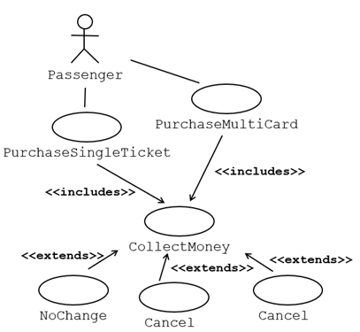
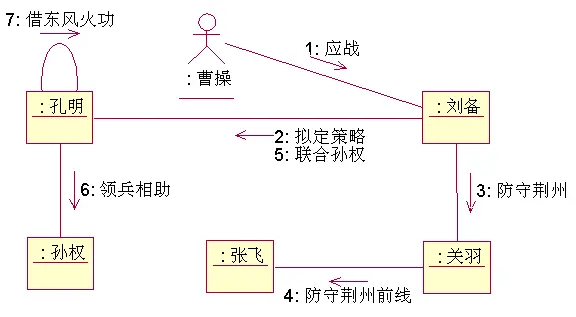

# Introduction to OOAD

#### 设计与分析的区别

| 分析           | 设计               |
| -------------- | ------------------ |
| 是什么         | 怎么做             |
| 需求           | 解决方案           |
| 领域考察       | 理解与描述解决方案 |
| 理解与描述问题 |                    |

面向对象分析强调发现和描述问题域中的对象或概念

面向对象设计强调定义逻辑软件 具有以下特征的对象（事物、概念或实体）属性和方法

**为什么要建模？**

1. Help us visualize a system as we want it to be 
2. Permits us to specify the structure or bahavior of a system
3. Give us a template that guides us in contructing a system
4. Documents the decision we have made

#### OOAD的过程包括

##### 定义用例模型

##### 构建领域模型

##### 构建交互图

##### 开发设计类图

## 开发流程

Rational Unified Process（RUP）是一种迭代式软件开发过程框架，由 Rational Software Corporation 创建，自 2003 年以来一直是 IBM 的一个部门。

RUP 不是一个单一的具体规定性过程，而是一个可适应的过程框架，旨在由开发组织和软件项目团队定制，他们将选择适合其需求的过程元素。RUP 是统一过程的一个具体实现。 

RUP 的目标是帮助组织应对当今不断变化的商业环境下开发软件产品的挑战。它提供了一种有纪律、有方法的方法来分配团队中的任务和责任。它用于构建复杂系统，并涵盖整个软件开发生命周期（SDLC）。RUP 可以应用于从小型应用程序到大型、复杂系统的各种项目类型。 

RUP 有四个主要阶段：初始、阐述、构建和过渡。每个阶段都有自己的目标、活动和可交付成果。RUP 由 Rational Software 在 20 世纪 90 年代创建，此后已成为最广泛使用的软件开发方法之一。

### 一. 敏捷开发

以人为**核心、迭代、循序渐进**的开发方式

简化文档，提取文档重点，主要在于**人与人之间的沟通**，

对开发产品进行迭代，最终完成开发。

> 迭代：迭代是指把一个复杂且开发周期很长的开发任务，分解为很多小周期可完成的任务，这样的一个周期就是一次迭代的过程；同时每一次迭代都可以生产或开发出一个可以交付的软件产品。

敏捷开发的一种实现方式就是**Scrum方式**：

Scrum开发流程中的三个项目角色

- 产品负责人(PO)：主要负责确定产品的功能和达到要求的标准，指定软件的发布日期和交付的内容，同时有权力接受或拒绝开发团队的工作成果。

- 流程管理员（SM）：主要负责整个Scrum流程在项目中的顺利实施和进行，以及清除挡在客户和开发工作之间的沟通障碍，使得客户可以直接驱动开发。

- 开发团队(ST)：主要负责软件产品在Scrum规定流程下进行开发工作，人数控制在5~10人左右，每个成员可能负责不同的技术方面，但要求每成员必须有很强的自我管理能力，同时具有一定的表达能力。

sprint：是短距离赛跑的意思，这里面指的是一次迭代，而一次迭代的周期是1个月时间（即4个星期），也就是我们要把一次迭代的开发内容以最快的速度完成它，这个过程我们称它为 Sprint。

1.首先我们需要确认一个 PB ( Product Backlog , 即按优先顺序排列的一个产品需求列表) ，这是由 PO（Product Owner） 负责的

2.ST（Scrum Team） 会根据 PB 列表，进行工作量的预估和安排

3.有了 PB 列表，我们需要通过 Sprint Planning Meeting( Sprint 计划会议)来从中挑选出一个 Story 作为本次迭代完成的目标，这个目标的时间周期是1~4个星期，然后把这个Story进行细化，形成一个Sprint Backlog

4.Sprint Backlog 是由 ST 去完成的，每个成员根据Sprint Backlog再细化成更小的任务（细到每个任务的工作量在2天内能完成）

5.在Scrum Team完成计划会议上选出的Sprint Backlog过程中，需要进行 Daily Scrum Meeting（每日站立会议），每次会议控制在15分钟左右，每个人都必须发言，并且要向所有成员当面汇报你昨天完成了什么，并且向所有成员承诺你今天要完成什么，同时遇到不能解决的问题也可以提出，每个人回答完成后，要走到黑板前更新自己的 Sprint burn down（Sprint燃尽图）

6.做到每日集成，也就是每天都要有一个可以成功编译、并且可以演示的版本；很多人可能还没有用过自动化的每日集成，其实TFS就有这个功能，它可以支持每次有成员进行签入操作的时候，在服务器上自动获取最新版本，然后在服务器中编译，如果通过则马上再执行单元测试代码，如果也全部通过，则将该版本发布，这时一次正式的签入操作才保存到TFS中，中间有任何失败，都会用邮件通知项目管理人员。

7.当一个Story完成，也就是Sprint Backlog被完成，也就表示一次Sprint完成，这时，我们要进行 Srpint Review Meeting（演示会议），也称为评审会议，产品负责人和客户都要参加（最好本公司老板也参加），每一个Scrum Team的成员都要向他们演示自己完成的软件产品（这个会议非常重要，一定不能取消）

8.最后就是 Sprint Retrospective Meeting（回顾会议），也称为总结会议，以轮流发言方式进行，每个人都要发言，总结并讨论改进的地方，放入下一轮Sprint的产品需求中。、

### 二. 瀑布式开发

严格按照需求文档,明确个人目标的一种开发模式

- 需求非常明确，

- 工作量十分可控，

- 对质量要求比较低，

- 业务建模也比较简单，

- 功能构成较少

这种开发模式如果范围控制和风险控制做的比较好的话，就真的如瀑布一般，‘飞流直下三千尺’，迅速完成客户期望，部署运行，一般都是在外包公司常见

阶段

1. 计划
2. 需求分析
3. 概要设计
4. 详细设计
5. 编码
6. 单元测试
7. 测试
8. 运维


有个缺点就是瀑布模型的周期是环环相扣的。每个周期中交互点都是一个里程碑，上一个周期的结束需要输出本次活动的工作结果，本次的活动的工作结果将会作为下一个周期的输入。这样，当某一个阶段出现了不可控的问题的时候，就会导致返工，返回到上一个阶段，甚至会延迟下一个阶段。

### 三. 螺旋型开发

尤其注重风险分析阶段，适用于庞大且复杂，高风险的项目，“螺旋模型”的核心就在于不需要在刚开始的时候就把所有事情都定义的清清楚楚。轻松上阵，定义最重要的功能，实现它，然后听取客户的意见，之后再进入到下一个阶段。如此不断轮回重复，直到得到您满意的最终产品。 

通常由四个阶段组成

1. 制定计划：确定软件目标，选定实施方案，弄清项目开发的限制条件；
2. 风险分析: 分析评估所选方案，考虑如何识别和消除风险； 
3. 实施工程:实施软件开发和验证； 
4. 客户评估:评价开发工作，提出修正建议，制定下一步计划。
   螺旋模型中，发布的第一个模型甚至可能是没有任何产出的，可能仅仅是纸上谈兵的一个目标，但是随着一次次的交付，每一个版本都会朝着固定的目标迈进，最终得到一个更加完善的版本。很大程度上是一种风险驱动的方法体系，因为在每个阶段之前及经常发生的循环之前，都必须首先进行风险评估。

### 四. 迭代开发

也被称作迭代增量式开发或迭代进化式开发，是一种与传统的瀑布式开发相反的软件开发过程，它弥补了传统开发方式中的一些弱点，具有更高的成功率和生产率。

#### 什么是迭代式开发？

每次只设计和实现这个产品的一部分, 
逐步逐步完成的方法叫迭代开发, 
每次设计和实现一个阶段叫做一个迭代. 

在迭代式开发方法中，整个开发工作被组织为一系列的短小的、固定长度（如3周）的小项目，被称为一系列的迭代。每一次迭代都包括了**需求分析、设计、实现与测试**。采用这种方法，开发工作可以在需求被完整地确定之前启动，并在一次迭代中**完成系统的一部分功能或业务逻辑的开发工作**。再通过客户的反馈来细化需求，并开始新一轮的迭代。

迭代式开发的优点：
　　1、降低风险
　　2、得到早期用户反馈
　　3、持续的测试和集成
　　4、使用变更
　　5、提高复用性


# RUP

### 迭代式开发Develop iteratively

给定的时间内，开发一个大型的复杂的软件系统，定义问题并构建解决方案是不可能一蹴而就的。在项目的开发过程中，由于体系结构方面的约束，客户的需要或对原始问题更精确的理解，需求会经常地变更。迭代式开发允许通过后续的细化产生对项目更好的理解，并在每个迭代的阶段，把项目的最高风险的事项作为最高优先级的任务集中精力解决。理想的，每一次迭代都以一个可执行的发布为结束，这样可以减少一个项目风险，更多地允许客户的交互并帮助开发人员集中精力。

### 管理需求Manage requirements

对于任何大型项目来说，一个文档框架是必不可少的；因此RUP描述了如何描述功能性，约束，设计决定和业务需求。

用例和场景是过程规定的制品的例子，在贯穿系统整个开发和部署的过程中，用例和场景在捕捉功能需求和提供一致的线索上是非常有效的。

### 使用基于构件的体系架构Employ a component-based architecture

基于构件的体系架构（CBA）创造了容易扩展的系统，并提升了软件的重用性和可读性。一个构件经常与[面向对象程序设计](https://zh.wikipedia.org/wiki/面向对象程序设计)中的一个对象有关。

RUP提供了构建这种系统的一个系统化的方法，关注于在把所有资源投入到一个项目之前，开发出一个早期的可执行的体系架构。

这些构件通过一些基础平台，如[CORBA](https://zh.wikipedia.org/wiki/CORBA)和[COM](https://zh.wikipedia.org/w/index.php?title=Component_object_model&action=edit&redlink=1)组装在一起。

### 软件的可视化建模Model software visually

将你的程序设计从代码上抽象出来，并用图形化构件块展现出来是得到解决方案的全面意象的一种有效方法。这对于项目的技术人员来说，一方面，能够更容易地勾画出如何最好的实现一个给定逻辑集合的轮廓，另一方面，能够更容易地构造在业务过程和实现业务过程的实际代码之间的中间物。

[统一建模语言](https://zh.wikipedia.org/wiki/统一建模语言)（UML）是表示项目的产业标准方法，因此经常被RUP使用。

### 验证软件质量Continuously verify quality

质量评估是所有软件项目中最经常的失败所在，因为通常这样项目的仅仅在项目总结中进行质量评估和甚至由另外的团队来进行质量评估。 RUP在规划质量控制和评估方面有所帮助，并把质量控制和评估包括在每个项目成员都参与的整个过程中。


### 控制软件的变更Control changes

在所有的软件项目中，变更是不可避免的，RUP定义了控制和监控变更的方法。一个表面上很小的变更可能以完全不可预计的方式对应用程序产生影响，这一点对一个成功项目至关重要。RUP同时定义了*安全的操作环境*，保证一个程序员对另一个系统的修改将不会对他系统地修改。这一点与基于构件的体系架构有很大的关系。

## 四个不同阶段

迄今为止，这些指导方针是通用的，可以在一个项目的生命周期中遵守。为了把握一个项目的时间尺度，RUP把一个项目分为四个不同的阶段：

1. **构思阶段Inception phase** ：包括用户沟通和计划活动两个方面，**强调定义和细化用例**，并将其作为主要模型。OOA
2. **细化阶段Elaboration phase** ：包括用户沟通和建模活动，重点是**创建分析和设计模型**，强调类的定义和体系结构的表示。OOD
3. **构建阶段Construction phase** ：将设计转化为**实现**，并进行集成和测试。OOP
4. **移交阶段Transition phase** ：将产品发布给用户进行测试评价，并收集用户的意见，之后再次进行迭代修改产品使之完善。


# UML相关概念

UML is  a language for **Visualizing, Specifying, Contruction, Documentation**.

在 UML（统一建模语言）中，事物（Thing）是建模元素的基本概念，它可以表示现实世界中的一个实体或概念。UML 将事物分为四类：结构性事物（Structural Thing）、行为性事物（Behavioral Thing）、分组事物（Grouping Thing）和注释性事物（Annotational Thing）。

- 结构性事物：用于表示系统中静态的部分，如类、接口、对象、组件和节点等。
- 行为性事物：用于表示系统中动态的部分，如交互、状态机和活动等。
- 分组事物：用于将模型元素组织在一起，如包和框架等。
- 注释性事物：用于对模型元素进行注释和解释，如注释等。

| 图     | 结点         | 边                     | 建模内容 |
| ------ | ------------ | ---------------------- | -------- |
| 用例图 | 参与者、用例 | 扩展、包含、继承、参与 | 需求建模 |
| 类图   | 类           | 关联、泛化、组合、聚合 | 结构建模 |
| 交互图 | 对象         | 信息、时间线           | 行为建模 |
| 状态图 | 状态、子状态 | 转换                   | 行为建模 |
| 活动图 | 活动         | 转换                   | 行为建模 |
| 包图   | 包           | 依赖                   | 结构建模 |
| 部署图 | 处理机、结点 | 依赖                   | 结构建模 |

Extension Mechanisms of UML：TaggedValue、Constraint、Stereotype

- **抽象类Abstract Class** - A class that will never be instantiated. An instance of this class will never exist.
- **行为者Actor** - An object or person that initiates events the system is involved with.
- **活动Activity**: A step or action within an Activity Diagram. Represents an action taken by the system or by an Actor.
- **活动图Activity Diagram**: A glorified flowchart that shows the steps and decisions and parallel operations within a process, such as an algorithm or a business process.
- **聚合Aggregation** - Is a part of another class. Shown with a hollow diamond next to the containing class in diagrams.
- **工件Artifacts** - Documents describing the output of a step in the design process. The description is graphic, textual, or some combination.
- **关联Association** - A connection between two elements of a Model. This might represent a member variable in code, or the association between a personnel record and the person it represents, or a relation between two categories of workers, or any similar relationship. By default, both elements in an Association are equal, and are aware of each other through the Association. An Association can also be a Navigable Association, meaning that the source end of the association is aware of the target end, but not vice versa.
- **关联类Association Class**: A Class that represents and adds information to the Association between two other Classes.
- **属性Attributes** - Characteristics of an object which may be used to reference other objects or save object state information.
- **基类Base Class**: A Class which defines Attributes and Operations that are inherited by a Subclass via a Generalization relationship.
- **分支Branch**: A decision point in an Activity Diagram. Multiple Transitions emerge from the Branch, each with a Guard Condition. When control reaches the Branch, exactly one Guard Condition must be true; and control follows the corresponding Transition.
- **类Class**: A category of similar Objects, all described by the same Attributes and Operations and all assignment-compatible.
- **类图Class Diagram** - Shows the system classes and relationships between them.
- **分类器Classifier**: A UML element that has Attributes and Operations. Specifically, Actors, Classes, and Interfaces.
- **协作Collaboration**: A relation between two Objects in a Communication Diagram, indicating that Messages can pass back and forth between the Objects.
- **通信图Communication Diagram** - A diagram that shows how operations are done while emphasizing the roles of objects.
- **组件Component**: A deployable unit of code within the system.
- **组件图Component Diagram**: A diagram that shows relations between various Components and Interfaces.
- **概念Concept** - A noun or abstract idea to be included in a domain model.
- **构建阶段Construction Phase** - The third phase of the Rational Unified Process during which several iterations of functionality are built into the system under construction. This is where the main work is done.
- **依赖性Dependence**: A relationship that indicates one Classifier knows the Attributes and Operations of another Classifier, but isn't directly connected to any instance of the second Classifier.
- **部署图Deployment Diagram**: A diagram that shows relations between various Processors.
- **领域Domain** -The part of the universe that the system is involved with.
- **阐述阶段Elaboration Phase** - The second phase of the Rational Unified Process that allows for additional project planning including the iterations of the construction phase.
- **元素Element**: Any item that appears in a Model.
- **封装Encapsulation** - Data in objects is private.
- **泛化Generalization** - Indicates that one class is a subclass on another class (superclass). A hollow arrow points to the superclass.
- **事件Event**: In a State Diagram, this represents a signal or event or input that causes the system to take an action or switch States.
- **最终状态Final State**: In a State Diagram or an Activity Diagram, this indicates a point at which the diagram completes.
- **分叉Fork**: A point in an Activity Diagram where multiple parallel control threads begin.
- **泛化Generalization**: An inheritance relationship, in which a Subclass inherits and adds to the Attributes and Operations of a Base Class.
- **GoF** - Gang of Four set of design patterns.
- **高内聚High Cohesion** - A GRASP evaluative pattern which makes sure the class is not too complex, doing unrelated functions.
- **低耦合Low Coupling** - A GRASP evaluative pattern which measures how much one class relies on another class or is connected to another class.
- **初始阶段Inception Phase** - The first phase of the Rational Unified Process that deals with the original conceptualization and beginning of the project.
- **继承Inheritance** - Subclasses inherit the attributes or characterics of their parent (superclass) class. These attributes can be overridden in the subclass.
- **初始状态Initial State**: In a State Diagram or an Activity Diagram, this indicates the point at which the diagram begins.
- **实例Instance** - A class is used like a template to create an object. This object is called an instance of the class. Any number of instances of the class may be created.
- **接口Interface**: A Classifier that defines Attributes and Operations that form a contract for behavior. A provider Class or Component may elect to Realize an Interface (i.e., implement its Attributes and Operations). A client Class or Component may then Depend upon the Interface and thus use the provider without any details of the true Class of the provider.
- **迭代Iteration** - A mini project section during which some small piece of functionality is added to the project. Includes the development loop of analysis, design and coding.
- **连接Join**: A point in an Activity Diagram where multiple parallel control threads synchronize and rejoin.
- **成员Member**: An Attribute or an Operation within a Classifier.
- **合并Merge**: A point in an Activity Diagram where different control paths come together.
- **消息Message** - A request from one object to another asking the object receiving the message to do something. This is basically a call to a method in the receiving object.
- **方法Method** - A function or procedure in an object.
- **模型Model** - The central UML artifact. Consists of various elements arranged in a hierarchy by Packages, with relations between elements as well.
- **多重性Multiplicity** - Shown in a domain model and indicated outside concept boxes, it indicates object quantity relationship to quantiles of other objects.
- **可导航性Navigability**: Indicates which end of a relationship is aware of the other end. Relationships can have bidirectional Navigability (each end is aware of the other) or single directional Navigability (one end is aware of the other, but not vice versa).
- **符号法Notation** - Graphical document with rules for creating analysis and design methods.
- **注释Note**: A text note added to a diagram to explain the diagram in more detail.
- **对象Object** - Object: In an Activity Diagram, an object that receives information from Activities or provides information to Activities. In a Collaboration Diagram or a Sequence Diagram, an object that participates in the scenario depicted in the diagram. In general: one instance or example of a given Classifier (Actor, Class, or Interface).
- **包Package** - A group of UML elements that logically should be grouped together.
- **包图Package Diagram**: A Class Diagram in which all of the elements are Packages and Dependencies.
- **模式Pattern** - Solutions used to determine responsibility assignment for objects to interact. It is a name for a successful solution to a well-known common problem.
- **参数Parameter**: An argument to an Operation.
- **多态性Polymorphism** - Same message, different method. Also used as a pattern.
- **私有Private**: A Visibility level applied to an Attribute or an Operation, indicating that only code for the Classifier that contains the member can access the member.
- **处理器Processor**: In a Deployment Diagram, this represents a computer or other programmable device where code may be deployed.
- **受保护Protected**: A Visibility level applied to an Attribute or an Operation, indicating that only code for the Classifier that contains the member or for its Subclasses can access the member.
- **公共Public**: A Visibility level applied to an Attribute or an Operation, indicating that any code can access the member.
- **阅读方向箭头Reading Direction Arrow** - Indicates the direction of a relationship in a domain model.
- **实现Realization**: Indicates that a Component or a Class provides a given Interface.
- **角色Role** - Used in a domain model, it is an optional description about the role of an actor.
- **序列图Sequence Diagram**: A diagram that shows the existence of Objects over time, and the Messages that pass between those Objects over time to carry out some behavior. State chart diagram - A diagram that shows all possible object states.
- **状态State**: In a State Diagram, this represents one state of a system or subsystem: what it is doing at a point in time, as well as the values of its data.
- **状态图State Diagram**: A diagram that shows States of a system or subsystem, Transitions between States, and the Events that cause the Transitions.
- **静态Static**: A modifier to an Attribute to indicate that there's only one copy of the Attribute shared among all instances of the Classifier. A modifier to an Operation to indicate that the Operation stands on its own and doesn't operate on one specific instance of the Classifier.
- **刻板印象Stereotype**: A modifier applied to a Model element indicating something about it which can't normally be expressed in UML. In essence, Stereotypes allow you to define your own "dialect" of UML.
- **子类Subclass**: A Class which inherits Attributes and Operations that are defined by a Subclass via a Generalization relationship.
- **泳道Swimlane**: An element of an Activity Diagram that indicates what parts of a system or a domain perform particular Activities. All Activities within a Swimlane are the responsibility of the Object, Component, or Actor represented by the Swimlane.
- **时间限制Time Boxing** - Each iteration will have a time limit with specific goals.
- **转换Transition**: In an Activity Diagram, represents a flow of control from one Activity or Branch or Merge or Fork or Join to another. In a State Diagram, represents a change from one State to another.
- **过渡阶段Transition Phase** - The last phase of the Rational Unified Process during which users are trained on using the new system and the system is made available to users.
- **UML** - Unified Modeling Language utilizes text and graphic documents to enhance the analysis and design of software projects by allowing more cohesive relationships between objects.
- **用例Use Case**: In a Use Case Diagram, represents an action that the system takes in response to some request from an Actor.
- **用例图Use Case Diagram**: A diagram that shows relations between Actors and Use Cases.
- **可见性Visibility**: A modifier to an Attribute or Operation that indicates what code has access to the member. Visibility levels include Public, Protected, and Private.
- **工作流程Workflow** - A set of activities that produces some specific result.

# 用例模型




## 用例图的元素组成

**参与者**（Actor）、**用例**（Use Case）和用例间的**关系**（Relationship）

### **一、 参与者**

**参与者**代表的是参与使用系统的一类角色，例如，读者就是图书馆这个系统的参与者。要正确把握参与者，需要注意以下几点：

\1. 参与者本身并不属于系统结构之中，位于**系统之外**；

\2. 参与者代表的是**一类**角色而不是一个具体对象，换言之，你可以说参与者是猪，而不能说参与者是“佩奇”；

\3. 参与者不一定是人，也可以是另一个外部的系统、环境等等。

UML中用一个小人图形表示参与者。我们给每一个参与者取特定的名字，并可以在文档中对用例进行描述。


UML中名为Passenger的参与者

对于别的系统或者服务：


### **二、 用例**

每个用例代表系统能够提供的**一类功能**(一个场景)，UML中使用一个椭圆形表示用例。


UML中名为PurchaseTicket的用例


### **三、 关系**

用例之间的关系只要包括三种，分别是**扩展**、**包含**和**继承**。

#### **1. 扩展**

扩展关系是在一个已有用例的基础上扩展新的功能而产生的关系，常用于对特殊情况的补充。比方说，购票“选票->付钱->出票->找零”本身是一个完整用例，但是在过程中可能出现零钱不足、缺票、用户中途取消等特殊状况，处理这些特殊状况的功能就是扩展功能。

扩展功能在UML中用**<<extends>>**和箭头表示，由子用例指向主用例。箭头的方向与主语->宾语一致。即 A extends B， 代表A扩展了B的功能，所以箭头由A指向B。


UML中扩展关系的应用

#### **2. 包含**

包含关系指一个主用例包含子用例。包含关系常用于子用例频繁被使用的情况。例如下图所示的例子，买单次票与买多次用卡的用例中都包含了收费这一子用例，为避免重复书写子用例，我们使用包含关系。


UML中包含关系的应用


包含关系在UML中用**<<includes>>**和箭头表示，箭头指向由主用例指向子用例。箭头方向依然可以用语法判断，若A包含B，箭头方向就是A指向B。

#### **3. 继承**

处于继承关系中的用例在不同抽象层，其中被继承的一方是继承的一方更概括抽象的概念。例如：主用例是“用户识别”，“人脸识别”是用户识别的一种，“指纹识别”也是用户识别的一种。在继承关系中常常出现“…是…的一种”**（is a kind of）**这样的关系，这可以帮助大家识别继承关系。下面是一个例子：


UML中继承关系的应用


在UML中，继承关系由一个**空心箭头**表示，由继承的一方指向被继承的一方（具体的一方指向抽象的一方）。

在用例图中，用例关系的箭头方向是比较容易出错的一点，我的记忆方法是带入“A extends B”，“A includes B” 和 “A inherits B”这样的句型，箭头永远从**主语指向宾语**。

• 老板测试 • EBP测试 •规模测试用于测试用例。

## 用例文本

每个用例在文档中都需要进行详细说明，说明中需要包含：

| 用例名称       | **登录系统**                                                 |
| -------------- | ------------------------------------------------------------ |
| 范围           | 电商平台                                                     |
| 级别           | 子功能                                                       |
| 主执行者       | 用户                                                         |
| 涉众及其关注点 | 用户：希望能够通过提供信息登录到系统中                       |
| 前置条件       | 用户申请登陆系统                                             |
| 成功保证       | 用户注册账号的相关信息被录入到了系统中                       |
| 主成功场景     | 用户请求登录→系统核验用户提交的信息，如若无误，则返回相关身份信息→相关信息更新至我的信息页面 |
| 扩展（替代流） | 1a. 用户使用微信登录：系统核验微信账号的资质→返回相关的微信账号信息1b. 用户使用账号密码登录：系统核验账号密码是否匹配→如若匹配，返回相关的账号信息2a信息不匹配：系统通知用户，提醒用户重新登录 |
| 特殊需求       |                                                              |
| 其他           |                                                              |

范围：系统用例或业务用例

级别：用户目标级别或基本业务流程

涉众及其关注点：关注该用例的人

前置条件：开始前必须具备的条件

成功保证：成功完成必须具备的条件

主成功场景：典型的、理想的过程步骤

扩展：成功、失败的替换场景

特殊需求：非功能性需求


# 领域模型

•范围：场景

•对领域内的概念类或现实世界中的对象的可视化表示//即 不是软件类

•可视化字典

•没有定义操作的类图

### 与其他制品的联系


•概念类、术语、概念、属性、关联：来自**用例**文本

•经历状态变化的领域对象、属性、关联：影响**操作契约**

•某些术语的精化：**词汇表**

•**设计模型**中的某些软件名称


领域模型说明了许多在问题领域内有意义的概念类图，是设计软件类的灵感来源。

一个领域模型可以用UML类图表示——结点表示概念类、结点的字段表示概念类的属性、边表示概念类之间的关联。

领域模型是一个抽象的系统，它描述了一个知识领域、影响或活动（一个领域）的选定方面。然后，该模型可以用来解决与该领域有关的问题。领域模型是与该领域有关的、需要在软件中建模的有意义的现实世界概念的表示。这些概念包括业务中涉及的数据和业务中使用的与这些数据有关的规则。领域模型利用该领域的自然语言。

领域模型通常使用该领域的词汇，从而使模型的表述能够被传达给非技术性的利益相关者。它不应该提及任何技术实现，如数据库或正在设计的软件组件。

### 如何寻找概念类：

1） 重用和修改现有的模型。

2） 使用分类列表

3） 确定名词短语

### **How to do Domain Modeling**

- **Identifying conceptual classes**

- **Finding Associations**

- **Adding Attribute**

- **Modeling Generalization**

#### 多重性 （multiplicity）

定义了类A有多少个实例可以和类B的一个实例关联（见图9-13）。  

例如，Store的一个实例可以和Item的 “多个”（“*”表示零个或多个）实例关联。  


#### 属性

领域模型中属性的类型更应该是数据类型(datatype)


类类型的属性应该用关联关系关联起来


# 系统时序图

### 与其他制品的联系

在**操作契约**中进行分析

在**词汇表**中进行描述（参数和返回值的细节）

作为**设计模型**的**启动**事件（顺序图的创始消息）

在UML中，子系统是具有行为和接口的独立实体。


### 系统顺序图的概念

**系统顺序图（System Sequence Diagram）**描述的是在特定的用例场景下，外部参与者、内部系统、以及他们之间的事件消息传递。顺序图阐述了直接与系统交互的外部参与者以及参与者发起的系统事件。在系统顺序图中，我们把所有的系统都看作黑盒，不关心其内部实现，只关心从参与者到系统的那些跨越系统边界的事件。

### 系统顺序图与用例的关系

系统顺序图SSD一般用于描述主要成功场景或者一些复杂的场景，而用例是用户利用某个系统实现特定目标的一系列成功或失败的场景的文本描述。可以说，系统顺序图是在用例的基础上建立起来的，是用例的一种延伸。

### 元素

- 参与者
  

- 系统
  

  一般是与用例相关的边界类、实体类等

- 生命线
  
  用一条竖直向下的虚线表示对象的存在时间

- 循环
  
  利用一个矩形框，表示框内动作的循环

### 消息类型

1. #### 同步消息

一个对象向另一个对象发出同步消息后，将处于阻塞状态，一直等到另一个对象的回应。


#### 2. 异步消息

一个对象向另一个对象发出异步消息后，这个对象可以进行其他的操作，不需要等到另一个对象的响应。


#### 3. 返回消息

表示从过程调用返回。


#### 4. 简单消息

不区分同步或异步。


### 系统顺序图SSD与顺序图SD的区别

虽然两者在画法上有很多类似之处，系统顺序图又是从顺序图变化而来，但是两者在细节上有不少区别。

系统顺序图SSD是用例的可视化表述，而顺序图SD是对象方法的可视化表述。

系统顺序图SSD的研究对象是**Actor参与者以及System系统**，而顺序图SD的研究对象是Object对象。

系统顺序图SSD中传递的消息可以是**参与者与系统之间的任意操作**，可以是一个具体的网络请求的方法调用，也以是抽象的人类行为。而顺序图SD中的消息传递是具体的方法调用（所以所指对象必须包含消息表示的方法）。

系统顺序图SSD是用例的延伸，用于帮助分析用例中参与者与系统的交互行为。顺序图SD是类的延伸，用于帮助分析某个类中的具体方法。

# 操作契约

有点像用例文本


操作：操作的名称和参数。 

交叉引用： 会发生此操作的用例。 

前置条件： 执行操作之前，对系统或领域模型对象状态的重要假设。这些假设比较重要 ，应该告诉读者。 

后置条件： 最重要的部分。完成操作后 .领域模型对象的状态。**创建实例、关联形成、属性修改**

# 交互图

交互图用来描述对象之间通过消息的交互、动态对象建模。

**顺序图**：顺序图是一种强调消息时间顺序的交互图，为读者提供了控制流随着时间推移的清晰的可视化轨迹

**通信图**：UML 2.0中的通信图实际上就是UML 1中的协作图，它强调的是参加交互的对象的组织，为读者提供了在协作对象结构组织的语境中观察控制流的一个清晰的可视化轨迹

**对比：**

| 类型   | 优势                                             | 劣势                               |
| ------ | ------------------------------------------------ | ---------------------------------- |
| 顺序图 | 能够清晰表现顺序和时间排序，大量的详细表示法选项 | 强制在右侧增加新对象；消耗水平空间 |
| 通信图 | 空间效用——能够在二维空间内灵活增加新对象         | 不宜查阅消息的顺序、表示法选项较少 |

## 顺序图


### 一、概述

时序图更多只是一种叫法，平常我们所说的顺序图、序列图也是在称呼它。

**时序图是基于交互的对象行为建模，是 UML 用于描述对象之间信息的交互过程的方法，是描述对象间协作关系的模型。**

时序图用于捕获系统运行中对象之间有时间顺序的交互，是由生命线和消息组成。

时序图将交互关系表示为一个二维图。纵向是时间轴，时间沿竖线向下延伸。横向轴代表了在协作中各独立对象的类元角色。类元角色用生命线表示。当对象存在时，角色用一条虚线表示，当对象的过程处于激活状态时，生命线是一个双道线。消息用从一个对象的生命线到另一个对象生命线的箭头表示。箭头以时间顺序在图中从上到下排列。

### 二、组成元素

#### 2.1、角色

这个角色可以是用户、外部系统、机器等等。

在 visio 软件中用下图表示：


#### 2.2、对象和生命线

关于对象的命名：

1. **对象名和类名**，例如：dispatcherServlet:DispatcherServlet
2. **只显示类名**，即表示它是一个匿名对象，例如：:DispatcherServlet
3. **只显示对象名不显示类名**，例如：dispatcherServlet

生命线：在时序图中表示为从对象图标向下延伸的一条虚线，表示对象存在的时间。


#### 2.3、活动条（执行规格条execution specification bar）

在生命线的虚线上可以用活动条来表示某种行为的开始和结束，一般用小矩形来表示。


在 visio 软件上称之为激活。


**注**：但是在这里我需要强调的是在生命线上并非一定要用活动条来表示执行的发生，活动条的加入是的执行发生更形象化，但是在繁多复杂的时序图中，活动条也会使图示变得更加复杂难以绘制，这种情况下，倾向于不使用活动条。

#### 2.4、消息

什么是消息？

在面向对象的分析和设计中，对象的行为也被称为消息，因为对象之间的行为的交互擢用也可以看成是对象之间发送消息实现的。通常，当一个对象调用另一个对象中的行为时，即完成了一次消息传递。

时序图中关注生命线之间的通信，这些通信就是对象发送的消息。UML用生命线间带有实心箭头的实现表示消息，每条消息从发送对象指向接收对象。

例如：


另外消息中还细分为了简单消息、同步消息和异步消息。

**简单消息**：就表示控制如何从一个对象发送给另一个对象，并不包含控制的细节。

**同步消息**：意味着阻塞和等待。如：A向B 发送一个消息后，对象A 必须一直等到B执行完成后返回才能继续往下执行。这就是同步消息。

**异步消息**：就意味着是非阻塞。如：A向B发送消息后，直接可以执行下面代码，无需等待B的执行。

同步消息用实心箭头表示，异步消息用开放式箭头表示。


自我调用消息：


消息的返回值：


#### 2.5、交互框

UML在2.0时在时序图中加入了交互框。交互框用来解决交互执行的条件和方式，它允许在序列图中直接表示逻辑组件，用于通过指定条件或子进程的应用区域，为任何生命线的任何部分定义特殊条件和子进程。组合片段共有13种，名称及含义如下：


但是我们只抽取几个常用的出来说一下，但本质上的用法是一样的。

##### 2.5.1、alt (选择片段)

简单说就是 将 if/else 在图示中表示出来了。


##### 2.5.2、opt

包含一个可能发生或不发生的序列；


只要当我成绩score小于60时，老妈打我这件事情肯定会发生。

大于就不会发生。

##### 2.5.3、Loop （循环）

片段重复一定次数，可以在临界中指示片段重复的条件。


##### 2.5.4、并行（Par）


#### 2.6 创建实例


#### 2.7 对象销毁


#### 2.8 调用类的静态方法


#### 2.9 多态


2.10 异步消息


### 三、【实例】

下图简述了SpringMVC的执行流程，这次我们的任务就是将它转换为时序图来表示。


画成时序图如下：


## 通信图（协作图）




**用例图、活动图、时序图之间的关系？**


#### 时序图与协作图之间的关系


**共同点：**二者都是用对象间的交互来描述用例的。


**案例：**时序图


**协作图**


**共同点：**时序图与协作图均显示了对象间的交互。


**不同点：**时序图强调交互的时间次序。

协作图强调交互的空间结构。

#### 案例剖析

**这里还使用上片文章中的赤壁之战的时序图来分析。**


**思考：**孔明向哪些对象发送了消息？又接收了哪些对象发送的消息？（可以根据这个典故，想想）


**协作图**


 时序图按照时间顺序布图，而写作图按照空间结构布图


协作图与时序图在语义上是等价的，二者可以相互转换，而不会丢失信息。（通过上面的例子，你可能已经看出他们之间的转化关系）

#### 协作图的构成

**对象、链接、消息**

**对象**


**链接**


**1、链接的概念**

链（link）是连接两个对象的路径，它指明了对象间某种可能的导航和可见性。更正式地说，链是关联的实例。

多个消息，以及消息共同的路径，即多个消息延着同一单链流转。

**2、链接的符号表示**

**链接以连接两个对象的单一线条表示。**


**消息**

**1、消息的概念**

消息是协作图中对象与对象之间通信的方式

**2、消息的类型与符号表示**


###### 消息编号

1）不为第一个消息编号。因此，msg1是未编号的。

2 ）使用合法编号方案来表示后续消息的顺序和嵌套，其中的嵌套消息要使用附加数字。通  过在外部消息编号后附加引入消息编号来表示嵌套。

##### 创建实例

任何消息都可以用来创建实例，但是在UML中约定使用名为create的消息来实现这一目的


##### 迭代


##### 多态


#### 时序图与协作图的转换

时序图和协作图在语义上是等价的，所以时序图和协作图可以彼此转换而不会损失信息。


## 区别


**共同点：**时序图与通信图均显示了对象间的交互。

**不同点：**时序图强调交互的时间次序，通信图强调交互的空间结构。

# 活动图

活动图描述系统元素的活动。UML活动图通过提供特定的场景内交流的图形化表示来**补充用例**。

活动图通常既能表示控制流又能表示数据流。

活动图提供了活动流程的可视化描述，可以是在系统、业务、工作流或其他过程中。这些图关注被执行的活动以及谁（或什么）负责执行这些活动。

## 一、基本概念

### 1. 活动节点

用来表示一个**活动**。


### 2. 初始节点和活动终点

**实心圆**表示**初始节点**（只有一个），**圆圈内加一个实心圆**来表示活动**终点**（可有多个）。


### 3. 转换

一条**带箭头的直线**来表示。 一旦前一个活动结束马上转到下一个活动（无触发转换）。


### 4. 分支与监护条件

**分支**是用**菱形**表示的，它有**一个进入转换**（箭头从外指向分支符号），**一个或多个离开转换**（箭头从分支符号指向外）。而**每个离开转换上都会有一个监护条件**，用来表示满足什么条件的时候执行该转换。


### 5. 分叉与汇合

**分叉**用于将动作流分为两个或者多个并发运行的分支，而**汇合**则用于同步这些并发分支，以达到共同完成一项事务的目的。

- **分叉**可以用来描述并发线程，每个分叉可以有一个输入转换和两个或多个输出转换，每个转换都可以是独立的控制流。
- **汇合**代表两个或多个并发控制流同步发生，当所有的控制流都达到汇合点后，控制才能继续往下进行。


------


**例1.购物用例图**


1、 泳道分为：会员泳道和系统泳道。会员选择商品并加入购物车，系统完成订单生成及其支付完毕。

2、 开始节点：会员添加商品到购物车，点击【订单确认】，开始交于系统处理订单流程

3、 结束节点：商品发送完毕和付款成功，订单处理流程结束

4、 活动状态：产生订单、Check Credit Cart核对信用卡、Check Stock 核对库存量、Deliver Goods 发送商品、Process Credit Cart付款

5、 分叉与汇合：【产生订单】份叉为检查库存量和会员支付金额是否足够，如果不足，取消订单，如过库存量和支付金额足够，发送商品和付款，最后汇合为订单完成。

 

**例2. 带有发送信号与接收信号的活动图**

[](http://images.cnblogs.com/cnblogs_com/TerryFeng/WindowsLiveWriter/UML_AFD4/image_20.png) 

 

**例3.带对象流的活动图**

[](http://images.cnblogs.com/cnblogs_com/TerryFeng/WindowsLiveWriter/UML_AFD4/image_16.png)

 

 

**例4.辅助活动图**

[](http://images.cnblogs.com/cnblogs_com/TerryFeng/WindowsLiveWriter/UML_AFD4/image_18.png)


# 类图

## 类描述

**「类」** 在UML中通常以实线矩形框表示。矩形框中有若干分割线。分别表示类名、属性和方法。如下图所示：


- `类名`：图中最上面的矩形框中为类名。如果字体为*斜体* ，表示为*抽象类* 。（图中的上面部分）
- `属性`：类名下边的区域。（图中的中间部分）
- `方法`：（图中的下面部分）

说明：属性和方法前面的“+”、“-”和“#”表示访问级别：

- `+`：public
- `-`：private
- `#`：protected

## 2. 接口描述

**「接口」** 的类图表述与类大致相同，不同的是接口名要添加 `Interface` 标识，且行为的可见性必须用 "+" 表示。如下图：


## 1. 继承（Inherit）

**「继承」** 是面向对象语言的三大特性（封装，继承，多态）之一。子类继承父类。


UML类图中继承关系使用空心三角形+实线表示。

## 2. 实现（Implement）

**「实现」** 与继承类似，实现类继承接口中的方法。


UML类图中实现关系使用空心三角形+虚线表示。

## 3. 关联

依赖关系通常表现为类的私有属性。

```kotlin
复制代码// 企鹅类
public class Penguin {
  // 天气类
  private Climate climate;
}
```

其UML类图表示如下：


UML类图中关联使用实线箭头表示。

## 4. 依赖

**「依赖」** 关系体现为局部变量、方法的形参，或者对静态方法的调用。

```typescript
复制代码public class Programmer {
  public void work(Computer computer){
    
  }
}
```


UML类图中依赖关系使用虚线箭头表示。

以下代码展示了依赖关系的三种具体代码实现：局部变量、方法的形参和对静态方法的调用。

```csharp
复制代码public class Person{
  public void doSomething1(){
    Car car = new Car();//局部变量
    ...
  }
  
  public void doSomething2(Car car){//方法参数
    ...
  }
  
  public void doSomething3(){
    int price = Car.do();//静态方法调用
  }
}
```

## 5. 组合

**「组合」** 是关联关系的一种，表示一种强的“拥有”关系。体现了严格的部分和整体的关系。部分和整体的生命周期一样。

```csharp
复制代码public class Bird {
  private Wing wing;
  public Bird() {
    this.wing = new Wing();
  }
}
```


UML类图中组合关系使用实心菱形+实线表示。

## 6. 聚合

**「聚合」** 是关联关系的一种，表示一种弱的“拥有”关系。

用Java代码表示大雁是群居动物，每只大雁都属于一个雁群，一个雁群可以有多只大雁。

> 天气凉了，树叶黄了。 。。。 一群大雁往南飞，一会排成“S”字，一会排成“B”字。 ——《秋天》出自人教版小学语文一年级课文

```kotlin
public class WildGooseAggregate {
  private List<WildGoose> wideGooses;
}
```


UML类图中聚合关系使用空心菱形实线表示。

### All in One的例子

前面介绍了类之间的6种关系。为了更好地理解这6种关系。下面使用一个完整的例子（汽车）。该示例中包含了这6种关系。


说明：

- 车的类图结构为，表示车是一个抽象类；
- 它有两个继承类：小汽车和自行车；它们之间的关系为**「实现」** 关系，使用带空心箭头的虚线表示；
- 小汽车为与SUV之间也是**「继承」** 关系，它们之间的关系为泛化关系，使用带空心箭头的实线表示；
- 小汽车与发动机之间是**「组合」** 关系，使用带实心箭头的实线表示；
- 学生与班级之间是**「聚合」** 关系，使用带空心箭头的实线表示；
- 学生与身份证之间为**「关联」** 关系，使用一根实线表示；
- 学生上学需要用到自行车，与自行车是一种**「依赖」** 关系，使用带箭头的虚线表示；


# 状态机图

### 1. 状态

对象在事件发生之间某时刻所处的情形，用**圆角矩形**表示。


### 2. 转移

两个状态之间的关系，它表明当某事发生时，对象先从当前状态转换到后来的状态，用**带有标记事件的箭头**表示。


### 3. 事件

事件是引发变迁的消息，用**箭头上的标记**（事件表达式）表示。

### 4. 初始状态/终止状态

初态用**实心圆**表示，终态用一对**同心圆**表示；


------

## 例题：商场购物卡

- 若某商场中发行一种**购物卡**，**用户**可以根据自己的需要提出**申请去办理购物卡**。
- 商场的**卡管理员**可以根据申请，**创建新的购物卡**。
- **用户**可以向购物卡**预存费用**，商场**卡管理员**为该用户**添加**相应的**预存费用**。
- **用户**可以用购物卡在商场进行**消费**，每进行一次消费，**售货员**就从购物卡中**扣除**相应的**费用**。
- 当购物消费每满一定数额时，**商场**自动在卡中**添加奖励费**。

## 分析：

从创建新卡开始（初始节点），动作有商场管理员往里面价款、售货员扣除消费费用、商场添加奖励费，到最后购物卡注销（终止节点）。


------

## 例题：POS机处理销售


------

## 例题：汽车停车场信息系统

某汽车停车场欲建立一个信息系统，需求如下：

1. 在停车场的入口和出口分别安装一个自动栏杆、一台停车卡打印机、一台读卡器和一个车辆通过传感器。
2. 当汽车到达入口时，驾驶员按下停车卡打印机的按钮获取停车卡。当驾驶员拿走停车卡后，系统命令栏杆自动抬起；汽车通过入口后，入口处的传感器通知系统发出命令，栏杆自动放下。
3. 在停车场内分布着若干个付款机器。驾驶员将在入口处获取的停车卡插入付款机器，并缴纳停车费。付清停车费之后，将获得一张出场卡，用于离开停车场。
4. 当汽车到达出口时，驾驶员将出场卡插入出口处的读卡器。如果这张卡是有效的，系统命令栏杆自动抬起；汽车通过出口后，出口传感器通知系统发出命令，栏杆自动放下。若这张卡是无效的，系统不发出栏杆抬起命令而发出告警信号。
5. 系统自动记录停车场内空闲的停车位的数量。若停车场当前没有车位，系统将在入口处显示“车位已满”信息。这时，停车卡打印机将不再出卡，只允许场内汽车出场。

请画出停车场入口护栏的状态图。

## 分析：

停车场入口护栏的**状态**有以下几个：有空闲车位，没有车位，等待打印停车卡，等待汽车进入，等待场内有空闲车位。


# 设计模式

#### GRASP (object-oriented design)

**General Responsibility Assignment Software Patterns** (or **Principles**)是GRASP的全称。

## Patterns

In object-oriented design, a pattern is a named description of a problem and solution that can be applied in new contexts; ideally, a pattern advises us on how to apply its solution in varying circumstances and considers the forces and trade-offs. Many patterns, given a specific category of problem, guide the assignment of responsibilities to objects.

### Information expert

See also: [Information hiding](https://en.wikipedia.org/wiki/Information_hiding)

Problem: What is a basic principle by which to assign responsibilities to objects?
Solution: Assign responsibility to the class that has the information needed to fulfill it.

**Information expert** (also **expert** or the **expert principle**) is a principle used to determine where to delegate responsibilities such as methods, computed fields, and so on.

Using the principle of information expert, a general approach to assigning responsibilities is to look at a given responsibility, determine the information needed to fulfill it, and then determine where that information is stored.

This will lead to placing the responsibility on the class with the most information required to fulfill it.[[3\]](https://en.wikipedia.org/wiki/GRASP_(object-oriented_design)#cite_note-Larman2004-3): 17:11 

**Related Pattern or Principle**: Low Coupling, High Cohesion

### Creator

See also: [Factory pattern](https://en.wikipedia.org/wiki/Factory_pattern)

The creation of objects is one of the most common activities in an object-oriented system. Which class is responsible for creating objects is a fundamental property of the relationship between objects of particular classes.

Problem: Who creates object `A`?
Solution: In general, Assign class `B` the responsibility to create object `A` if one, or preferably more, of the following apply:

- Instances of `B` contain or compositely aggregate instances of `A`
- Instances of `B` record instances of `A`
- Instances of `B` closely use instances of `A`
- Instances of `B` have the initializing information for instances of `A` and pass it on creation.[[3\]](https://en.wikipedia.org/wiki/GRASP_(object-oriented_design)#cite_note-Larman2004-3): 16:16.7 

**Related Pattern or Principle**: Low Coupling, [Factory pattern](https://en.wikipedia.org/wiki/Factory_pattern)

### Controller

The **controller** pattern assigns the responsibility of dealing with system events to a non-[UI](https://en.wikipedia.org/wiki/User_Interface) class that represents the overall system or a [use case](https://en.wikipedia.org/wiki/Use_case) scenario. A controller object is a non-user interface object responsible for receiving or handling a system event.将UI类发起的系统事件（用例）分配给非UI类完成

Problem: **Who should be responsible for handling an input system event?**
Solution: A *use case controller* should be used to deal with *all* system events of a use case, and may be used for more than one use case. For instance, for the use cases *Create User* and *Delete User*, one can have a single class called *UserController*, instead of two separate use case controllers. Alternatively a *facade controller* would be used; this applies when the object with responsibility for handling the event represents the overall system or a root object.


The controller is defined as the first object beyond the UI layer that receives and coordinates ("controls") a system operation. The controller should delegate the work that needs to be done to other objects; it coordinates or controls the activity. It should not do much work itself. The GRASP Controller can be thought of as being a part of the application/service layer[[4\]](https://en.wikipedia.org/wiki/GRASP_(object-oriented_design)#cite_note-Yahoo-4) (assuming that the application has made an explicit distinction between the application/service layer and the [domain layer](https://en.wikipedia.org/wiki/Domain_layer)) in an object-oriented system with common layers in an information system logical architecture.

**Related Pattern or Principle**: [Command](https://en.wikipedia.org/wiki/Command_pattern), [Facade](https://en.wikipedia.org/wiki/Facade_pattern), [Layers](https://en.wikipedia.org/wiki/Layer_(object-oriented_design)), Pure Fabrication

### Indirection

The indirection pattern supports low coupling and reuses potential between two elements by **assigning the responsibility of mediation between them to an intermediate object**. An example of this is the introduction of a controller component for mediation between data (model) and its representation (view) in the model-view-controller pattern. This ensures that coupling between them remains low.将Controller作为Model和View的中间媒介。

Problem: Where to assign responsibility, to avoid direct coupling between two (or more) things? How to de-couple objects so that low coupling is supported and reuse potential remains higher?

Solution: Assign the responsibility to an intermediate object to mediate between other components or services so that they are not directly coupled.
The intermediary creates an **indirection** between the other components.

### Low coupling

Main article: [Loose coupling](https://en.wikipedia.org/wiki/Loose_coupling)

Coupling is a measure of how strongly one element is connected to, has knowledge of, or relies on other elements. **Low coupling** is an evaluative pattern that dictates how to assign responsibilities for the following benefits:

- lower dependency between the classes,
- change in one class having a lower impact on other classes,
- higher reuse potential.

### High cohesion

Main article: [Cohesion (computer science)](https://en.wikipedia.org/wiki/Cohesion_(computer_science))

**High cohesion** is an evaluative pattern that attempts to keep objects appropriately focused, manageable and understandable. High cohesion is generally used in support of low coupling. High cohesion means that the **responsibilities of a given set of elements are strongly related and highly focused on a rather specific topic.** Breaking programs into classes and subsystems, if correctly done, is an example of activities that increase the cohesive properties of named classes and subsystems. Alternatively, low cohesion is a situation in which a set of elements, of e.g., a subsystem, has too many unrelated responsibilities. Subsystems with low cohesion between their constituent elements often suffer from being hard to comprehend, reuse, maintain and change as a whole.[[3\]](https://en.wikipedia.org/wiki/GRASP_(object-oriented_design)#cite_note-Larman2004-3): 314–315 

> **内聚有如下的种类，它们之间的内聚度由弱到强排列如下**：
>    **（1） 偶然内聚**            模块中的代码无法定义其不同功能的调用。但它使该模块能执行不同的功能，这种模块称为巧合强度模块。    
>    **（2） 逻辑内聚**            这种模块把几种相关的功能组合在一起， 每次被调用时，由传送给模块参数来确定该模块应完成哪一种功能。    
>    **（3） 时间内聚**：            把需要同时执行的动作组合在一起形成的模块为时间内聚模块。    
>    **（4）过程内聚**：            构件或者操作的组合方式是，允许在调用前面的构件或操作之后，马上调用后面的构件或操作，即使两者之间没有数据进行传递。    
>    **（5）通信内聚**：            指模块内所有处理元素都在同一个数据结构上操作（有时称之为信息内聚），或者指各处理使用相同的输入数据或者产生相同的输出数据。    
>    **（6）顺序内聚**：            指一个模块中各个处理元素都密切相关于同一功能且必须顺序执行，前一功能元素输出就是下一功能元素的输入。    
>    **（7） 功能内聚**：            这是最强的内聚，指模块内所有元素共同完成一个功能，缺一不可。     
>    **三、耦合可以分为以下几种，它们之间的耦合度由高到低排列如下**：
>    **（1） 内容耦合：**            如果发生下列情形，两个模块之间就发生了内容耦合        一个模块直接访问另一个模块的内部数据
> 一个模块不通过正常入口转到另一模块内部；
> 两个模块有一部分程序代码重叠(只可能出现在汇编语言中)；
> 一个模块有多个入口。
>
> **（2）公共耦合：**            若一组模块都访问同一个公共数据环境，则它们之间的耦合就称为公共耦合。公共的数据环境可以是全局数据结构、共享的通信区、内存的公共覆盖区等。    
>    **（3）外部耦合**            一组模块都访问同一全局简单变量而不是同一全局数据结构，而且不是通过参数表传递该全局变量的信息，则称之为外部耦合。    
>    **（4） 控制耦合**            如果一个模块通过传送开关、标志、名字等控制信息，明显地控制选择另一模块的功能，就是控制耦合    
>    **（5）标记耦合**            一组模块通过参数表传递记录信息，就是标记耦合。这个记录是某一数据结构的子结构，而不是简单变量。其实传递的是这个数据结构的地址；也就是地址传递。    
>    **（6） 数据耦合**            指两个模块之间有调用关系,传递的是简单的数据值，一个模块访问另一个模块时，彼此之间是通过简单数据参数 (不是控制参数、公共数据结构或外部变量) 来交换输入、输出信息的,相当于高级语言的值传递。    
>    **（7） 非直接耦合**            两个模块之间没有直接关系，它们之间的联系完全是通过主模块的控制和调用来实现的。

### Polymorphism

Main article: [Polymorphism in object-oriented programming](https://en.wikipedia.org/wiki/Polymorphism_in_object-oriented_programming)

According to the **polymorphism** principle, **responsibility for defining the variation of behaviors based on type is assigned to the type for which this variation happens.基于类型定义行为变体的责任分配给发生此变体的类型。** This is achieved using [polymorphic](https://en.wikipedia.org/wiki/Polymorphism_(computer_science)) operations. The user of the type should use polymorphic operations instead of explicit branching based on type.

Problem: How to handle alternatives based on type? How to create pluggable software components?
Solution: When related alternatives or behaviors vary by type (class), assign responsibility for the behavior—using polymorphic operations—to the types for which the behavior varies. (Polymorphism has several related meanings. In this context, it means "giving the same name to services in different objects".)

### Protected variations

See also: [Open/closed principle](https://en.wikipedia.org/wiki/Open/closed_principle)

The **protected variations** pattern protects elements from the variations on other elements (objects, systems, subsystems) by wrapping the focus of instability with an [interface](https://en.wikipedia.org/wiki/Interface_(computer_science)) and using [polymorphism](https://en.wikipedia.org/wiki/Polymorphism_(computer_science)) to create various implementations of this interface.变异：对一个类的修改导致其他类同时发生改动。

Problem: How to design objects, subsystems, and systems so that the variations or instability in these elements does not have an undesirable impact on other elements?
Solution: Identify points of predicted variation or instability; assign responsibilities to **create a stable interface** around them.

### Pure fabrication

See also: [Service (systems architecture)](https://en.wikipedia.org/wiki/Service_(systems_architecture))

A **pure fabrication** is a class that **does not represent a concept in the problem domain**, specially made up to achieve low coupling, high cohesion, and the reuse potential thereof derived (when a solution presented by the *information expert* pattern does not). This kind of class is called a "service" in [domain-driven design](https://en.wikipedia.org/wiki/Domain-driven_design).

**Related Patterns and Principles** • Low Coupling. • High Cohesion.


# 4+1 View

****


## Logical View 逻辑视图

架构视图描述系统的顶层设计，系统为了完成功能（要解决的问题），需要那些对象以及他们之间的关系是什么（即实现域），同时要完成一些支撑功能实现的通用机制的设计。此时还处于一个比较高的层次，不需要引入太多的细节，只考虑具有架构意义的元素，多用类图/对象图表示，采用抽象、继承、封装的原则，使用关联、依赖、继承、组合等表示其关系。

## Development View开发视图

开发视图聚焦于**软件模块的组织和软件开发环境（语言、框架等）**。康威定律在此处体现。软件需要分层，分块，然后定义良好的接口用于多团队并行开发。
 系统的开发架构用模块和子系统图来表达，显示了"输出"和"输入"关系。完整的开发架构只有当所有软件元素被识别后才能加以描述。但是，在此之前可以列出控制开发架构的规则：分块、分组和可见性。
 大部分情况下，开发架构考虑的内部需求与以下几项因素有关：开发难度、软件管理、重用性和通用性及由工具集、编程语言所带来的限制。
 开发视图可用于需求分解、项目进度监控，可用于论证软件的重用性、可移植性和安全性，它是建立产品线的基础。
 分解后的开发视图，N个子系统可以分布在M个层中，每个层可以包含多个模块。


## Physical View 物理视图（Deployment View）

把软件映射到硬件。
 物理视图聚焦于软件的非功能性需求，例如可用性、可靠性（容错）、性能（吞吐量）和可伸缩性。物理视图展示软件网络结点、进程、任务、对象到硬件结点的部署关系。软件的部署应尽可能灵活，减少对原代码的影响/依赖。可以根据对不同硬件资源的性能/容量的诉求，设计出不同物理视图的部署方式，如下两图：


## Process View运行视图

运行视图需要考虑，如何让逻辑视图中的对象运行起来。此时需要考虑一些非功能性需求（例如性能，可靠性等），同时需要考虑并发、部署、系统集成、容错性等。
 运行视图可以分为几层抽象：

- 1 最高层可以看做一组独立可执行的通信程序（processes）的逻辑网络（network）。这些逻辑网络结点分布在一组硬件资源上，通过wan/lan进行连接。设计过程中，多个逻辑网络可以并存，共享同一套物理资源。（例如同一套物理资源，要承载离线系统和在线系统两套运行视图）
- 2 第二层可以看做单个进程（process）。每个进程由一组可执行的任务（task）组成，在这个层次上，要能够表达进程的启动、停止、重配置、恢复、重启等控制策略（例如一些进程复位重启等自愈策略）。另外，进程要可以独立部署进行负荷分担，以提升系统的可用性。
- 3 第三层是任务级（task），任务包括主要任务和次要任务。主要任务是设计的重点，是描述系统的主要架构元素，要保证接口的标准和通用。次要任务是一些内部的辅助实现任务（例如一些周期触发、缓冲、暂停等），实现上可以更灵活一些。主要任务的通讯通过严格定义的通信机制：基于消息的同步或异步通信服务、远程过程调用、事件广播等。次要任务则以会见（rendezvous）或共享内存来通信。在同一过程或处理节点上，主要任务不应对它们的分配做出任何假定。


## Use-case View/场景视图Scenarios View

也称用例视图
 场景视图在某种意义上讲是对最重要需求的一种抽象，将上述4视图连接在一起的纽带。因此场景视图看似多余（因此归为+1）。但是它至少有两个重要功能：

- 1 驱动我们去发现架构元素（领域对象等），用于架构设计过程中的其它视图。
- 2 用于架构设计完成后，对架构的的使用说明以及测试验证的参考。
  场景视图基本的建模元素跟逻辑视图类似，但是描述关系的方式使用了运行视图的表达方式。

# MVC架构

模型-视图-控制器(MVC)

- 视图负责应用的展示
- 模型封装了应用的数据和业务逻辑
- 控制器负责接收用户的输入

> 该模型负责管理应用程序的数据。它接收来自控制器的用户输入。
> 视图以特定的格式渲染模型的表现。
> 控制器响应用户的输入，并在数据模型对象上执行交互操作。控制器接收输入，选择性地验证它，然后将输入传递给模型。

# POS机

POS机的用途：

1. To accept payments from customers

2. To verify and record payment information

3. To generate receipts and other documents

4. To update inventory records in real-time as you sell products

5. To track customer behavior so you can make improvements to your business.

提供的服务：

客户管理：跟踪客户数据，如联系信息、购买历史，甚至是忠诚度奖励。

库存管理：按地点和产品类别管理库存水平。

销售点：从一个屏幕或多个屏幕运行交易，以加快结账柜台的排队速度。

客户服务：为客户提供自助服务选项，如在线订购或移动结账，只需在触摸屏上点击几下鼠标或用手指敲击一下。


**Use Case** UC1: Process Sale

**Scope**: NextGen POS application 

**Level**: user goal 

**Primary Actor**: Cashier 

**Stakeholders and interests:**

​	 •Cashier: Wants accurate, fast entry, and no payment errors, … 

​	• Salesperson: Wants sales commissions updated 

​	•Customers: Wants purchase and fast service with minimum effort,… 

​	•Company: Wants to accurately record transactions and …

​	•Manager: Wants to be able to quickly perform override operations, … 

​	•Government Tax Agencies: Want to collect tax from every sale. …. 

​	•Payment Authorization Service: Wants to receive digital authorization request in  the correct format and protocol, … 

**Preconditions**: Cashier is identified and authenticated 

**Success Guarantee** (or Postconditions): Sale is saved. Tax is correctly calculated.  Accounting and inventory are updated. Commissions recorded. Receipt is generated. Payment authorization approvals are recorded

**Main Success Scenario** (or Basic Flow):  

1. Customer arrives at POS checkout with goods and/or services to purchase
2. Cashier starts a new sale 
3. Cashier enters item identifier 
4. System records sale line item and presents item description, price, and running  total. Price calculated from a set of price rule Cashier repeats steps 3-4 until indicates done
5. System presents total with taxes calculated. 
6. Cashier tells Customer the total, and asks for payment
7. Customer pays and System handles payment 
8. System logs completed sale and send sale and payment information to the  external Accounting system (for accounting and commissions) and Inventory  system (to update inventory) 
9. System presents receipt. 
10. Customer leaves with receipt and goods (if any).

**Extensions (or Alternative Flow)**:  

*a. At any time, Manager requests and override operations: 1. System enters Manager-authorized modes 2. Manager or Cashier performs one Manager-mode operation, e.g.  cash balance change, resume a suspended sale on … 3. System reverts to Cashier-authorized mode. 

*b. … 

1a. Customer or Manager indicate to resume a suspended sale. 

1. Cashier performs resume operations, and enters the ID to retrieve  the sale 

2. System displays the state of the resumed sale, with subtotal. 

   … 

   2-4a. Customer tells Cashier they have a tax-exempt status (e.g., seniros) 

   1. Cashier verifies, and then enters tax-exempt status code. 
   2. System records status (which it will used during tax calculation) 

   3a. Invalid item ID (not found in system); 1. …


